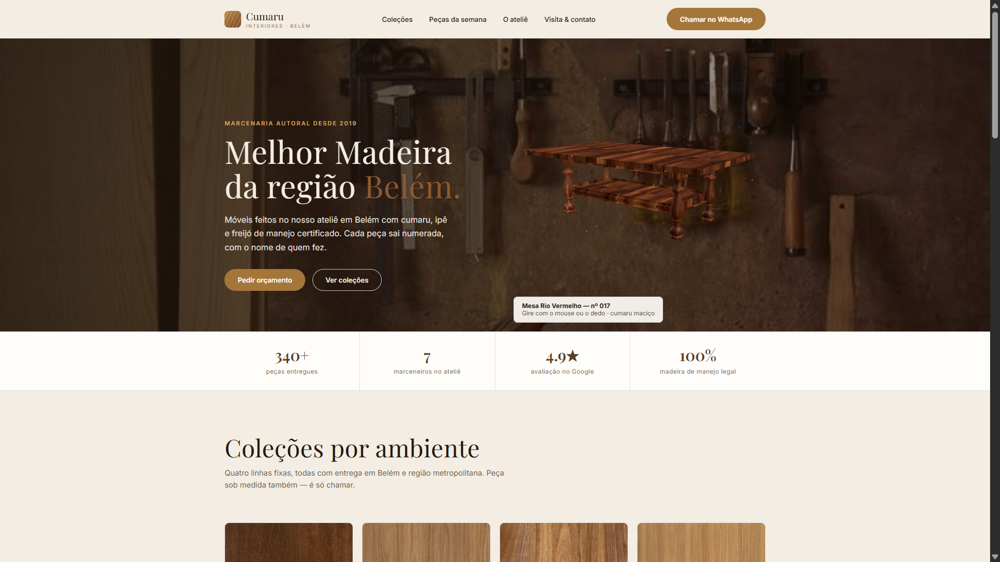

# Cumaru Interiores — Landing Page Conceito

Landing page para uma marcenaria fictícia da região amazônica, com modelo 3D interativo, funcionamento offline e layout responsivo. Projeto de estudo e portfólio.

**Demo ao vivo:** https://agent-6a5f7e967b61331e4893f5--cumaru-interioires.netlify.app/



---

## Sobre o projeto

Cumaru Interiores é uma marca fictícia criada para este estudo: uma marcenaria de Belém-PA que trabalha com madeiras amazônicas de manejo certificado (cumaru, ipê e freijó). Todo o conteúdo — nomes, depoimentos, preços e história — é ficcional.

O objetivo foi construir uma vitrine digital adequada à realidade de um pequeno negócio do Norte do Brasil: celulares de entrada, conexões instáveis e donos de negócio sem equipe técnica.

## Decisões de design

- Tipografia: Playfair Display (títulos) e Inter (texto);
- Paleta em tons de creme, chocolate e caramelo, derivada das amostras de madeira exibidas no site;
- Cards de coleção mostram a textura da madeira de cada linha, em vez de fotos genéricas de ambiente;
- No mobile, a ordem do conteúdo é: título, modelo 3D, descrição e botões, com elementos centralizados;
- As animações respeitam a preferência de movimento reduzido do usuário (prefers-reduced-motion).

## Otimização do modelo 3D

O modelo original da mesa (.obj) tinha 8,9 MB e cerca de 88 mil vértices, o que inviabilizaria o uso em celulares. A otimização foi feita em Python, sem bibliotecas de geometria:

1. Leitura do arquivo OBJ e remoção da geometria de cena (plano de fundo);
2. Redução de malha por agrupamento de vértices (vertex clustering) em grade 3D;
3. Triangulação com remoção de faces degeneradas;
4. Geração de coordenadas de textura (UV) por projeção box-mapping, já que o modelo não tinha UVs;
5. Empacotamento dos dados em binário (Float32) codificado em base64, embutido no HTML.

Resultado: de 8,9 MB para aproximadamente 295 KB (cerca de 9,3 mil vértices), renderizados com Three.js, textura de madeira e correção de cor sRGB.

## Como executar

Para visualizar o site, basta abrir o arquivo `index.html` em um navegador. Não há dependências nem etapa de build.

Para regenerar o modelo 3D e as texturas, é necessário Python 3.8+ e a biblioteca Pillow:

```bash
pip install Pillow
python3 process_obj.py       # otimiza o modelo .obj e gera o payload
python3 apply_textures.py    # comprime as texturas e injeta no HTML
```

Observação: os scripts usam caminhos fixos do ambiente original de desenvolvimento. Ajuste as constantes no início de cada arquivo para os seus diretórios.

## Implantação

O site é um arquivo único e estático, hospedado atualmente no Netlify. Também funciona no GitHub Pages (renomeando o arquivo para `index.html`) ou em qualquer hospedagem estática. Como todas as imagens estão embutidas no HTML, a página funciona offline.

## Tecnologias utilizadas

- HTML5 e CSS3 (grid areas, custom properties), sem frameworks;
- Three.js r128 para a renderização 3D em WebGL;
- Python 3 (biblioteca padrão) para o processamento do modelo;
- Pillow para a compressão das imagens;
- Google Fonts (Playfair Display e Inter).

## Autor

Lúcio Henrique Ribeiro Costa
Estudante de Sistemas de Informação (UNIFESSPA) — Marabá-PA
[GitHub](https://github.com/Luciocosta1302) · [LinkedIn](https://www.linkedin.com/in/luciohrcosta)

## Créditos

- Marca, pessoas, depoimentos e preços são fictícios;
- Fotos de peças e texturas de madeira: bancos de imagem e materiais de referência de terceiros, usados apenas para demonstração;
- Modelo 3D: arquivo de estudo processado e otimizado pelo autor.
